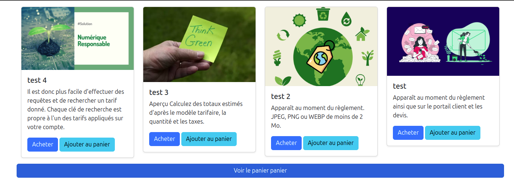
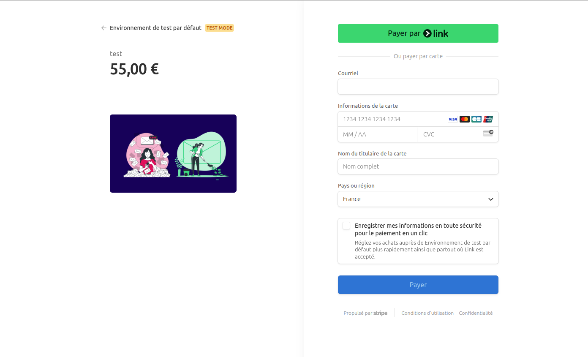
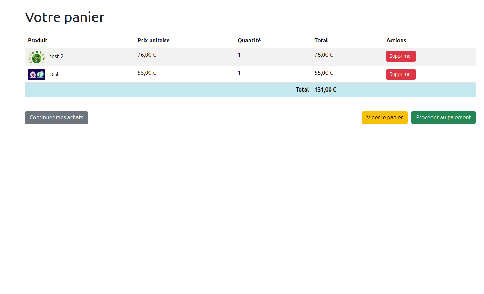
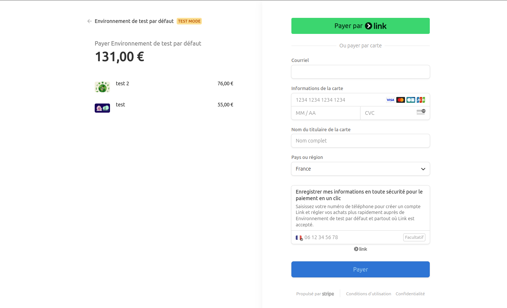

# Documentation du projet Symfony-Stripe-Redis

## Vue d'ensemble

Cette application est une boutique en ligne développée avec le framework Symfony 7.2. Elle permet d'afficher des produits provenant de l'API Stripe et offre deux parcours d'achat principaux : soit l'achat direct d'un produit, soit l'ajout au panier puis le paiement groupé. L'application utilise Redis pour la gestion des sessions et le stockage des paniers.

**Technologies clés :**
- Symfony 7.2
- Redis (via talleu/php-redis-om)
- Stripe API
- PHPUnit pour les tests
- Webpack Encore pour les assets

---

## Architecture technique

### Pile technologique

L'application est construite sur une architecture MVC avec les technologies suivantes :

- **Backend** : PHP 8.2, Symfony 7.2
- **Stockage des données** :
  - Redis pour les sessions et les paniers
  - Pas de base de données relationnelle (les produits sont gérés via Stripe)
- **Frontend** : Twig, CSS, JavaScript avec Webpack Encore
- **Services externes** : API Stripe pour les produits et les paiements
- **Serveur web** : Compatible avec Apache (inclut symfony/apache-pack)

### Flux de données

1. Les produits sont récupérés depuis l'API Stripe
2. Les informations du panier sont stockées dans Redis avec une clé unique par session
3. Les sessions utilisateur sont gérées par Symfony
4. Les paiements sont traités directement par Stripe via sa plateforme Checkout

---

## Installation

### Prérequis

- PHP 8.2 ou supérieur
- Composer
- Serveur Redis
- Compte Stripe avec clés API
- Node.js et Yarn/npm pour les assets

### Étapes d'installation

1. **Cloner le dépôt**
   ```bash
   git clone https://github.com/ludovicdevio/symfony-stripe
   cd symfony-stripe-redis
   ```

2. **Installer les dépendances PHP**
   ```bash
   composer install
   ```

3. **Installer les dépendances JavaScript**
   ```bash
   npm install
   # ou
   yarn install
   ```

4. **Compiler les assets**
   ```bash
   npm run build
   # ou
   yarn build
   ```

5. **Configurer les variables d'environnement**
   - Copier le fichier .env en .env.local
   - Mettre à jour les clés API Stripe et l'URL Redis

6. **Vérifier que Redis est accessible**
   ```bash
   redis-cli ping
   ```

7. **Lancer le serveur de développement**
   ```bash
   symfony server:start -d
   ```

---

## Configuration

### Variables d'environnement

Le projet utilise les variables d'environnement suivantes :

| Variable | Description | Exemple |
|----------|-------------|---------|
| `APP_ENV` | Environnement d'exécution | `dev`, `prod` |
| `APP_SECRET` | Clé secrète pour la sécurité | `4a8050593dbd7630482adbe8345d2c17` |
| `STRIPE_API_KEY` | Clé privée Stripe | `sk_test_51R14ka...` |
| `STRIPE_PUBLIC_KEY` | Clé publique Stripe | `pk_test_51R14ka...` |
| `REDIS_URL` | URL de connexion Redis | `redis://password@127.0.0.1:6379` |

### Configuration Redis

Redis est utilisé pour stocker les paniers d'achat. La configuration est gérée par le bundle `talleu/php-redis-om`. Les entités sont configurées avec des annotations `RedisOm\Entity`.

### Configuration Stripe

Stripe est configuré via le service `StripeService` qui initialise le client avec la clé API définie dans les variables d'environnement. L'application utilise Stripe pour :
- Récupérer les produits
- Obtenir les prix
- Créer des sessions de paiement

---

## Fonctionnalités

### Catalogue de produits
- Affichage des produits issus de Stripe
- Détails des produits (nom, description, prix, image)

### Panier d'achat
- Ajout de produits au panier
- Affichage du contenu du panier
- Modification des quantités
- Suppression d'articles
- Vidage complet du panier

### Processus d'achat
- Achat direct d'un produit
- Achat groupé du contenu du panier
- Redirection vers Stripe Checkout
- Gestion des succès/annulations de paiement

### Feedbacks utilisateur
- Messages de confirmation pour les actions
- Gestion des erreurs avec messages explicites
- Redirection vers des pages appropriées

---

## Structure du code

### Entités

#### Cart
```php
#[RedisOm\Entity]
class Cart
{
    #[RedisOm\Id]
    #[RedisOm\Property]
    public ?string $id;

    #[RedisOm\Property]
    public array $products = [];
}
```

#### CartProduct
```php
#[RedisOm\Entity]
class CartProduct
{
    #[RedisOm\Id]
    #[RedisOm\Property]
    public ?string $id = null;

    #[RedisOm\Property]
    public ?int $quantity = null;
}
```

### Services

#### SessionService
Gère la persistance des identifiants de panier dans la session utilisateur.

#### CartService
Gère les opérations CRUD sur le panier :
- Récupération du panier
- Ajout de produits
- Suppression de produits
- Vidage du panier
- Obtention des détails de produits pour affichage

#### StripeService
Interface avec l'API Stripe pour :
- Récupérer les produits actifs
- Trouver un produit par ID
- Récupérer les prix
- Générer les URLs de paiement Stripe

### Contrôleurs

#### HomeController
Point d'entrée principal de l'application avec les routes pour :
- Affichage de la page d'accueil
- Achat direct d'un produit
- Gestion du panier
- Traitement des paiements

---

## API et intégrations

### API Stripe

L'application utilise l'API Stripe pour :

1. **Produits**
   - Récupération de la liste des produits actifs
   - Récupération des détails d'un produit

2. **Prix**
   - Récupération du prix actif d'un produit

3. **Paiements**
   - Création de sessions de paiement Checkout
   - Configuration des URLs de succès et d'annulation

### Redis OM

L'application utilise le bundle Redis Object Mapper pour :

1. **Stockage de données**
   - Persistance des paniers d'achat
   - Mapping objet-Redis avec annotations

2. **Opérations sur les données**
   - Recherche par ID
   - Sauvegarde des entités
   - Mise à jour des collections imbriquées

---

## Tests

L'application inclut des tests unitaires avec PHPUnit. Les tests couvrent principalement :

### Tests des services
- Test de `SessionService` pour la génération d'IDs de panier
- Test de `CartService` pour les opérations CRUD
- Test de `StripeService` avec mocks pour éviter les appels à l'API réelle

### Exécution des tests

Pour exécuter les tests :

```bash
php bin/phpunit
```

Pour un test spécifique :

```bash
php bin/phpunit --filter=FusionTest
```

### Mocks et stubs

Les tests utilisent des classes de test spécifiques comme `TestableStripeService` pour éviter les appels à l'API Stripe en environnement de test.

---










Cette documentation fournit une vue d'ensemble complète de l'application Symfony-Stripe-Redis. Pour toute question ou clarification, n'hésitez pas à contacter l'équipe de développement.
